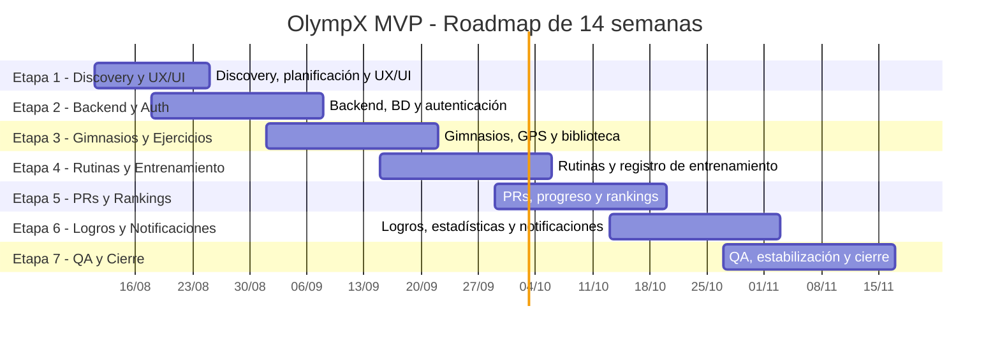

# OlympX - Carta Gantt MVP

> Roadmap ejecutivo de 14 semanas según la línea base de `AnexoMVP copy.md`.
> El MVP Core se entrega en 8 semanas y la fase extendida concluye en la semana 14.

## Resumen Ejecutivo

| Etapa | Semanas | Entregable principal                      | Estado        |
| ----: | :-----: | ----------------------------------------- | ------------- |
|     1 |   1-2   | Discovery, planificación y diseño UX/UI   | Parcial       |
|     2 |   2-4   | Backend, base de datos y autenticación    | Casi completa |
|     3 |   4-6   | Gimnasios, GPS y biblioteca de ejercicios | Parcial alta  |
|     4 |   6-8   | Rutinas y registro de entrenamiento       | Parcial alta  |
|     5 |  8-10   | PRs, progreso y rankings                  | Parcial media |
|     6 |  10-12  | Logros, estadísticas y notificaciones     | Parcial media |
|     7 |  12-14  | QA, estabilización y cierre               | Inicial       |

**Referencia de alcance:** Etapas 1 a 4 corresponden al MVP Core de 8 semanas. Etapas 5 a 7
corresponden a la fase extendida de la cotización.

## Decision De Alcance

El lanzamiento corresponde al **MVP ampliado con red social**. El entrenamiento y el progreso
son el flujo core, acompañado por feed, publicaciones, comentarios, likes, reacciones, follows,
perfiles públicos, alertas y rankings. Multimedia avanzada, stories, coach y retención avanzada
quedan fuera de este corte.

## Cronograma Base De 14 Semanas

> Fechas de referencia calculadas desde el inicio del proyecto el 11/08/2026. Las etapas se
> superponen en las semanas indicadas en el anexo original.

## Detalle de Actividades

| Actividad | Alcance                                              | Entregable                   |
| --------- | ---------------------------------------------------- | ---------------------------- |
| Discovery | Alcance MVP, historias de usuario y prioridades      | Backlog aprobado             |
| UX/UI     | Flujos mobile, design system y estados de interfaz   | Prototipo y componentes base |
| Contratos | Tipos compartidos, envelope y reglas de integración  | Paquete `olympx-contracts`   |
| Auth      | Registro, login, sesión y roles                      | Acceso funcional             |
| Perfil    | Datos personales, avatar y ubicación                 | Perfil editable              |
| Gimnasios | Búsqueda, GPS, gimnasio principal y check-in         | Red de gimnasios operativa   |
| Sesiones  | Sesiones, sets, detalle e historial                  | Registro de entrenamiento    |
| Rutinas   | Días, ejercicios, objetivos y plantillas             | Biblioteca de rutinas        |
| Progreso  | Volumen, reps, 1RM, PRs y evolución                  | Panel de progreso            |
| Feed      | Publicaciones y paginación                           | Feed social                  |
| Social    | Comentarios, likes, reacciones y follows             | Interacción comunitaria      |
| Comunidad | Tab social, perfiles públicos y descubrimiento       | Experiencia de comunidad     |
| Ranking   | Podio, filtros y posición personal                   | Competencia general          |
| Logros    | Conquistas por actividad y rendimiento               | Sistema de logros            |
| QA        | Flujos críticos, regresiones y E2E                   | Informe de calidad           |
| Seguridad | Validaciones, permisos, rendimiento y observabilidad | Checklist de release         |

## Hitos Según Anexo

| Hito                                     | Semana | Fecha de referencia | Criterio de salida                                            |
| ---------------------------------------- | -----: | ------------------: | ------------------------------------------------------------- |
| H1 - Discovery y UX/UI aprobado          |      2 |          24/08/2026 | Alcance, arquitectura y flujos clave definidos                |
| H2 - Backend y autenticación operativos  |      4 |          07/09/2026 | API, Prisma, health check, JWT y envelope funcionales         |
| H3 - Gimnasios y ejercicios operativos   |      6 |          21/09/2026 | Gimnasio principal, GPS, check-in y catálogo disponibles      |
| H4 - MVP Core operativo                  |      8 |          05/10/2026 | Crear rutinas, registrar entrenamientos y consultar historial |
| H5 - PRs y rankings disponibles          |     10 |          19/10/2026 | PRs, tonelaje, progreso, 1RM y rankings funcionales           |
| H6 - Logros y notificaciones disponibles |     12 |          02/11/2026 | Logros, estadísticas y alertas básicas disponibles            |
| H7 - MVP extendido listo                 |     14 |          16/11/2026 | QA, estabilización y build de entrega aprobados               |

## Entregables MVP

- Auth con registro, login, persistencia de sesión y control de acceso.
- Perfil editable con avatar, nickname, región, provincia y comuna.
- Gimnasios cercanos, gimnasio principal y check-in.
- Sesiones de entrenamiento, sets, historial y progreso.
- Rutinas editables con días, ejercicios, sets y reps objetivo.
- Feed social, publicaciones, comentarios, likes, reacciones y follows.
- Compartir progreso semanal como publicación social.
- Compartir logros desbloqueados como publicaciones sociales.
- Perfiles públicos, logros y ranking general.
- Ranking por ejercicio basado en 1RM estimado.
- Tab dedicada de Comunidad.
- Panel administrativo y moderación básica.

## Estado Actual

Actualmente el producto se encuentra en una fase avanzada de implementación funcional y adelantada
respecto de las actividades de construcción del calendario. El riesgo está concentrado en la
validación E2E del MVP social, RevenueCat real/Test Store, push en dispositivo físico, seguridad,
rendimiento y decisión operativa sobre web/admin.

### Corte Ejecutivo - 26/08/2026

Los porcentajes siguientes son una estimación de avance del frente, no una métrica de cobertura de
código. Se separa el avance funcional de la preparación real para release, porque el core ya está
operativo pero todavía quedan validaciones de producción.

| Frente          | Avance estimado | Evidencia actual                                                                      | Pendiente principal                                                |
| --------------- | --------------: | ------------------------------------------------------------------------------------- | ------------------------------------------------------------------ |
| Fundación       |            100% | Alcance ampliado, contratos, arquitectura y navegación base                           | Ninguno bloqueante                                                 |
| Cuenta y perfil |            100% | Auth, onboarding, perfil, avatar, ubicación y gimnasios validados                     | Recuperación, cambio y eliminación de cuenta                       |
| Entrenamiento   |             80% | Sesiones, sets, historial, PRs, progreso y cola offline funcional                     | Validar rutinas completas, límites y reintentos físicos            |
| Comunidad       |             90% | Feed, posts, comentarios, likes, reacción rápida, follows y compartir progreso/logros | Decidir multimedia y validar compartir fuera de la app             |
| Competencia     |             75% | Rankings, 1RM, rangos de fuerza y logros disponibles                                  | Categorías, calibración por sexo, frecuencia y percentiles         |
| Release         |             50% | Builds, typechecks, 152 tests API y smoke mobile iOS/Android                          | Integración, seguridad, rendimiento, RevenueCat real y push físico |

**Lectura ejecutiva:** el avance funcional del MVP ampliado está aproximadamente en **80%**. La
preparación para declarar release está aproximadamente en **50%**, porque los riesgos restantes son
principalmente de validación, integraciones reales y operación, no de construcción del core.

### Hitos Al Corte

| Hito                                     | Estado        | Comentario                                                                 |
| ---------------------------------------- | ------------- | -------------------------------------------------------------------------- |
| H1 - Discovery y UX/UI aprobado          | Parcial       | Documentación y arquitectura listas; prototipo maestro de Figma pendiente  |
| H2 - Backend y autenticación operativos  | Casi completo | API, Prisma, health check, JWT y envelope funcionales                      |
| H3 - Gimnasios y ejercicios operativos   | Parcial alta  | Gimnasios, GPS, check-in y catálogo implementados; falta evidencia final   |
| H4 - MVP Core operativo                  | Parcial alta  | Sesiones, rutinas, sets, historial y progreso implementados; faltan bordes |
| H5 - PRs y rankings disponibles          | Parcial media | PRs, 1RM, rangos y rankings implementados; faltan calibración y cobertura  |
| H6 - Logros y notificaciones disponibles | Parcial media | Logros, estadísticas y alertas implementados; falta push físico            |
| H7 - MVP extendido listo                 | Inicial       | Faltan integración, seguridad, rendimiento y validación de release         |

## Riesgos y Mitigaciones

| Riesgo                                            | Impacto | Mitigación                                               |
| ------------------------------------------------- | ------- | -------------------------------------------------------- |
| Tests E2E pendientes                              | Alto    | Automatizar login, perfil, comunidad y entrenamiento     |
| Migraciones Prisma pendientes en algunos entornos | Alto    | Ejecutar `prisma migrate deploy` en staging y producción |
| Comunidad inicialmente basada en texto            | Medio   | Preparar storage para imágenes y videos después del MVP  |
| Muchas tabs en mobile                             | Medio   | Revisar navegación y consolidar accesos secundarios      |
| API y mobile evolucionan en paralelo              | Medio   | Mantener contratos compartidos y typechecks obligatorios |

## Criterios de Salida

- `typecheck` correcto en API, mobile y contracts.
- Migraciones aplicadas en staging.
- Flujos críticos cubiertos por E2E.
- Sin errores bloqueantes en auth, entrenamiento, comunidad o ranking.
- Manejo consistente de estados loading, vacío, offline y error.
- Build mobile y API reproducible para release.
