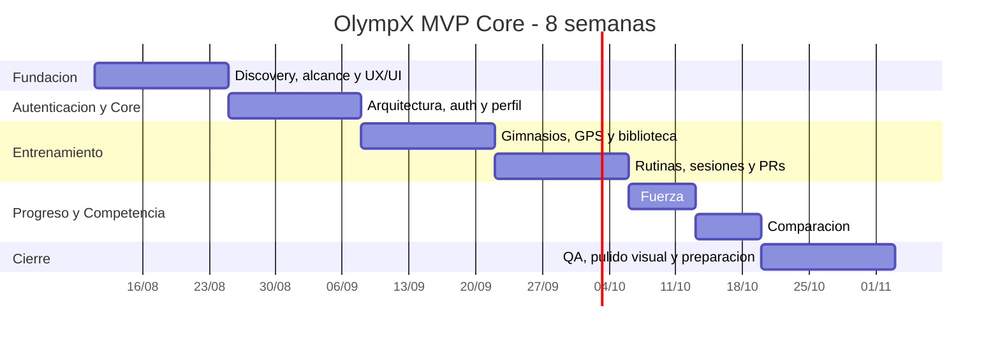

# OlympX - Carta Gantt MVP

> Cronograma ejecutivo del MVP en 8 semanas.

## Hitos

- Hito 1: base de producto y autenticacion lista.
- Hito 2: entrenamiento y gimnasio operativo.
- Hito 3: progreso, PRs y comparacion funcional.
- Hito 4: QA, ajustes finales y entrega MVP.
