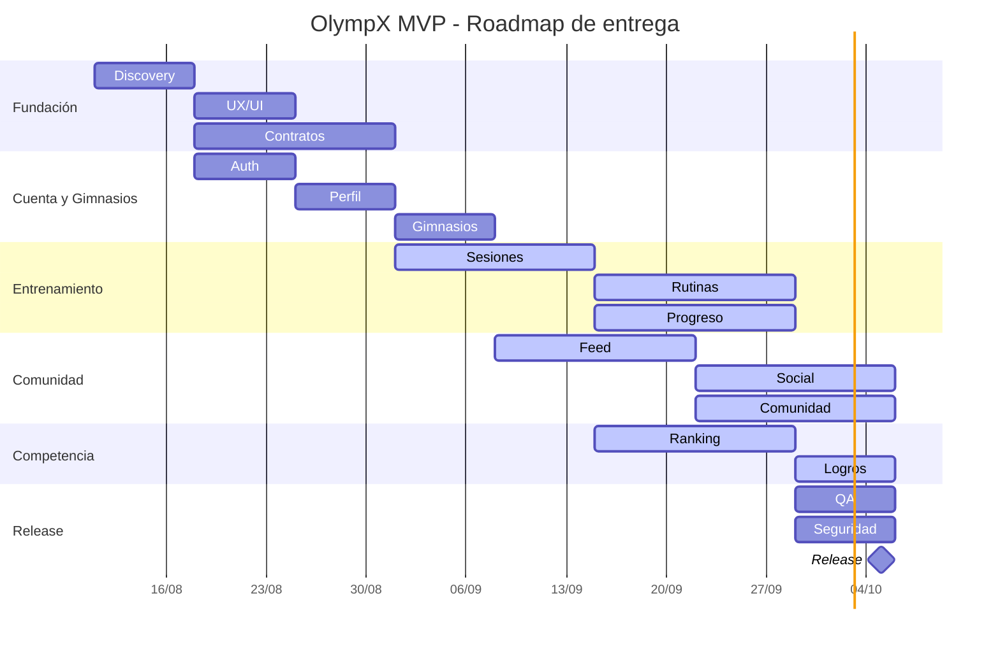

# OlympX - Carta Gantt MVP

> Roadmap ejecutivo de 8 semanas para entregar el MVP de la red social competitiva de gimnasio.

## Resumen Ejecutivo

| Frente | Semanas | Entregable principal | Estado |
|---|---:|---|---|
| Fundación | 1-2 | Alcance, UX/UI, arquitectura y contratos | Completado |
| Cuenta y perfil | 2-3 | Auth, perfiles, ubicación y gimnasios principales | Completado |
| Entrenamiento | 3-6 | Sesiones, sets, rutinas, PRs y progreso | En curso |
| Comunidad | 4-7 | Feed, publicaciones, comentarios, reacciones y follows | En curso |
| Competencia | 5-7 | Ranking general, ranking por ejercicio y logros | En curso |
| Release | 7-8 | QA, seguridad, pulido visual y preparación de entrega | Pendiente |

## Decision De Alcance

El lanzamiento corresponde al **MVP ampliado con red social**. El entrenamiento y el progreso
son el flujo core, acompañado por feed, publicaciones, comentarios, likes, reacciones, follows,
perfiles públicos, alertas y rankings. Multimedia avanzada, stories, coach y retención avanzada
quedan fuera de este corte.

## Cronograma

## Detalle de Actividades

| Actividad | Alcance | Entregable |
|---|---|---|
| Discovery | Alcance MVP, historias de usuario y prioridades | Backlog aprobado |
| UX/UI | Flujos mobile, design system y estados de interfaz | Prototipo y componentes base |
| Contratos | Tipos compartidos, envelope y reglas de integración | Paquete `olympx-contracts` |
| Auth | Registro, login, sesión y roles | Acceso funcional |
| Perfil | Datos personales, avatar y ubicación | Perfil editable |
| Gimnasios | Búsqueda, GPS, gimnasio principal y check-in | Red de gimnasios operativa |
| Sesiones | Sesiones, sets, detalle e historial | Registro de entrenamiento |
| Rutinas | Días, ejercicios, objetivos y plantillas | Biblioteca de rutinas |
| Progreso | Volumen, reps, 1RM, PRs y evolución | Panel de progreso |
| Feed | Publicaciones y paginación | Feed social |
| Social | Comentarios, likes, reacciones y follows | Interacción comunitaria |
| Comunidad | Tab social, perfiles públicos y descubrimiento | Experiencia de comunidad |
| Ranking | Podio, filtros y posición personal | Competencia general |
| Logros | Conquistas por actividad y rendimiento | Sistema de logros |
| QA | Flujos críticos, regresiones y E2E | Informe de calidad |
| Seguridad | Validaciones, permisos, rendimiento y observabilidad | Checklist de release |

## Hitos

| Hito | Fecha objetivo | Criterio de salida |
|---|---:|---|
| H1 - Base de producto | 24/08 | Auth, perfil, contratos y navegación estables |
| H2 - Entrenamiento operativo | 14/09 | Crear sesión, registrar sets y consultar historial |
| H3 - Comunidad funcional | 28/09 | Publicar, comentar, reaccionar y seguir atletas |
| H4 - Competencia funcional | 28/09 | Ranking, PRs y logros disponibles |
| H5 - MVP listo | 05/10 | QA crítico aprobado y build de release generado |

## Entregables MVP

- Auth con registro, login, persistencia de sesión y control de acceso.
- Perfil editable con avatar, nickname, región, provincia y comuna.
- Gimnasios cercanos, gimnasio principal y check-in.
- Sesiones de entrenamiento, sets, historial y progreso.
- Rutinas editables con días, ejercicios, sets y reps objetivo.
- Feed social, publicaciones, comentarios, likes, reacciones y follows.
- Compartir progreso semanal como publicación social.
- Compartir logros desbloqueados como publicaciones sociales.
- Perfiles públicos, logros y ranking general.
- Ranking por ejercicio basado en 1RM estimado.
- Tab dedicada de Comunidad.
- Panel administrativo y moderación básica.

## Estado Actual

Actualmente el producto se encuentra en una fase avanzada de implementación funcional y adelantada
respecto de las actividades de construcción del calendario. El riesgo está concentrado en la
validación E2E del MVP social, RevenueCat real/Test Store, push en dispositivo físico, seguridad,
rendimiento y decisión operativa sobre web/admin.

## Riesgos y Mitigaciones

| Riesgo | Impacto | Mitigación |
|---|---|---|
| Tests E2E pendientes | Alto | Automatizar login, perfil, comunidad y entrenamiento |
| Migraciones Prisma pendientes en algunos entornos | Alto | Ejecutar `prisma migrate deploy` en staging y producción |
| Comunidad inicialmente basada en texto | Medio | Preparar storage para imágenes y videos después del MVP |
| Muchas tabs en mobile | Medio | Revisar navegación y consolidar accesos secundarios |
| API y mobile evolucionan en paralelo | Medio | Mantener contratos compartidos y typechecks obligatorios |

## Criterios de Salida

- `typecheck` correcto en API, mobile y contracts.
- Migraciones aplicadas en staging.
- Flujos críticos cubiertos por E2E.
- Sin errores bloqueantes en auth, entrenamiento, comunidad o ranking.
- Manejo consistente de estados loading, vacío, offline y error.
- Build mobile y API reproducible para release.
