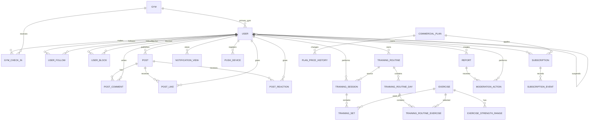

# OlympX - Modelo Relacional Actual

> Diseño de la base de datos implementada actualmente en `olympx-api/prisma/schema.prisma`.

## 1. Control Del Documento

| Campo                          | Valor                                                  |
| ------------------------------ | ------------------------------------------------------ |
| Fuente de verdad               | `olympx-api/prisma/schema.prisma`                      |
| Diagrama editable              | `ModeloRelacionalActual.dbml`                          |
| Motor                          | PostgreSQL                                             |
| ORM                            | Prisma                                                 |
| Corte                          | 26/08/2026                                             |
| Estado                         | Implementado y sincronizado en desarrollo              |
| Modelo planificado relacionado | `ModeloRelacionalMVP.md` y `ModeloRelacionalGlobal.md` |

Este documento describe el estado real del esquema. No agrega entidades que estén solamente
propuestas en la documentación de producto.

## 2. Vista General

La base actual está organizada en seis dominios:

| Dominio                    | Entidades principales                                                        | Responsabilidad                                  |
| -------------------------- | ---------------------------------------------------------------------------- | ------------------------------------------------ |
| Identidad y contexto       | `User`, `Gym`, `GymCheckIn`                                                  | Usuarios, roles, perfil, ubicación y gimnasios   |
| Entrenamiento              | `Exercise`, `TrainingRoutine*`, `TrainingSession`, `TrainingSet`             | Rutinas, sesiones, series y métricas             |
| Social                     | `Post`, `PostComment`, `PostLike`, `PostReaction`, `UserFollow`, `UserBlock` | Feed e interacción entre usuarios                |
| Notificaciones y operación | `NotificationView`, `PushDevice`, `Report`, `ModerationAction`, `AuditLog`   | Alertas, dispositivos, reportes y moderación     |
| Competencia                | `ExerciseStrengthRange`                                                      | Rangos de fuerza publicados por ejercicio        |
| Comercial                  | `CommercialPlan`, `Subscription*`, `Coupon`, `CommercialSettings`            | Planes, trials, suscripciones, cupones y límites |

## 3. Diagrama Relacional Actual



`AuditLog`, `Report.targetId` y `NotificationView.notificationId` mantienen referencias lógicas
sin una FK directa a una entidad única. Se detallan en la sección de observaciones.

## 4. Inventario De Entidades

### 4.1 Identidad Y Contexto

| Entidad      | PK   | FKs                         | Restricciones e índices relevantes                     |
| ------------ | ---- | --------------------------- | ------------------------------------------------------ |
| `User`       | `id` | `gymId`, `suspendedById`    | `email` y `nickname` únicos; estado `ACTIVE/SUSPENDED` |
| `Gym`        | `id` | -                           | Estado de verificación `PENDING/VERIFIED`; `isActive`  |
| `GymCheckIn` | `id` | `userId`, `gymId`           | Índices por usuario/fecha y gimnasio/fecha             |
| `UserFollow` | `id` | `followerId`, `followingId` | Único por par de usuarios; índice por seguido/fecha    |
| `UserBlock`  | `id` | `blockerId`, `blockedId`    | Único por par; índices por origen y destino            |

**Campos relevantes de `User`:** email, contraseña hasheada, rol, estado, nickname, perfil físico,
región, provincia, comuna, avatar, gimnasio principal, última ubicación, consentimiento legal,
onboarding y datos de suspensión.

**Campos relevantes de `Gym`:** nombre, dirección, coordenadas, cadena, ciudad, región, estado de
actividad y estado de verificación.

### 4.2 Ejercicios Y Competencia

| Entidad                 | PK   | FKs          | Propósito                                               |
| ----------------------- | ---- | ------------ | ------------------------------------------------------- |
| `Exercise`              | `id` | -            | Catálogo de ejercicios y participación competitiva      |
| `ExerciseStrengthRange` | `id` | `exerciseId` | Rango de peso por nivel, en estado borrador o publicado |

`Exercise` contiene nombre, grupo muscular, tipo, categoría, imagen y flag `competitive`.
`ExerciseStrengthRange` contiene nivel, peso mínimo, peso máximo y estado de publicación.

### 4.3 Entrenamiento

| Entidad                   | PK   | FKs                            | Restricciones e índices relevantes               |
| ------------------------- | ---- | ------------------------------ | ------------------------------------------------ |
| `TrainingRoutine`         | `id` | `userId`                       | Índice por usuario y fecha de actualización      |
| `TrainingRoutineDay`      | `id` | `routineId`                    | Índice por rutina y posición                     |
| `TrainingRoutineExercise` | `id` | `dayId`, `exerciseId`          | Índice por día/posición y ejercicio              |
| `TrainingSession`         | `id` | `userId`, `routineId` opcional | `idempotencyKey` único; estado, timestamps de ciclo de vida e índice por usuario/fecha |
| `TrainingSet`             | `id` | `sessionId`, `exerciseId`      | Índices por sesión y ejercicio                   |

`TrainingSession` registra título, estado (`DRAFT`, `ACTIVE`, `FINISHED` o `CANCELLED`), inicio,
fin, duración, intensidad, notas, fecha de ejecución y rutina de origen. `TrainingSet` registra
peso, repeticiones, RPE, RIR, calentamiento, participación competitiva y 1RM estimado.

El PR y el progreso no tienen una tabla propia en el esquema actual: se calculan a partir de
`TrainingSet` y `TrainingSession`.

### 4.4 Social

| Entidad        | PK   | FKs                | Restricciones e índices relevantes                     |
| -------------- | ---- | ------------------ | ------------------------------------------------------ |
| `Post`         | `id` | `userId`           | `idempotencyKey` único; contenido y fechas             |
| `PostComment`  | `id` | `postId`, `userId` | Comentario asociado a publicación y autor              |
| `PostLike`     | `id` | `postId`, `userId` | Único por publicación y usuario                        |
| `PostReaction` | `id` | `postId`, `userId` | Único por publicación, usuario y tipo; índice por tipo |

Los tipos actuales de reacción son `FIRE`, `EXECUTION`, `PROGRESS`, `DOMINATED`, `DISAPPROVE` y
`FUNNY`.

### 4.5 Notificaciones, Moderación Y Auditoría

| Entidad            | PK   | FKs                       | Propósito                                            |
| ------------------ | ---- | ------------------------- | ---------------------------------------------------- |
| `NotificationView` | `id` | `userId`                  | Marca persistida de una notificación vista           |
| `PushDevice`       | `id` | `userId`                  | Token de dispositivo FCM/APNs y plataforma           |
| `Report`           | `id` | `reporterId`              | Reporte sobre usuario, post o comentario             |
| `ModerationAction` | `id` | `reportId`, `moderatorId` | Historial de decisión de moderación                  |
| `AuditLog`         | `id` | Ninguna FK física         | Registro de actor, entidad, acción, razón y metadata |

`Report.targetType` identifica si el reporte apunta a `USER`, `POST` o `COMMENT`, y `targetId`
guarda el identificador correspondiente. `AuditLog.entityType` y `entityId` usan el mismo patrón
polimórfico para mantener auditoría sobre distintos dominios.

### 4.6 Comercial

| Entidad              | PK   | FKs                | Restricciones e índices relevantes                 |
| -------------------- | ---- | ------------------ | -------------------------------------------------- |
| `CommercialPlan`     | `id` | -                  | Precio, moneda, límites, trial y producto externo  |
| `PlanPriceHistory`   | `id` | `planId`           | Índice por plan y fecha                            |
| `Subscription`       | `id` | `userId`, `planId` | Índices por usuario, plan, estado y fin de periodo |
| `SubscriptionEvent`  | `id` | `subscriptionId`   | Índices por suscripción/fecha y tipo/fecha         |
| `Coupon`             | `id` | -                  | `code` único; índice por actividad                 |
| `CommercialSettings` | `id` | -                  | Límites globales y configuración de trial          |

Los estados comerciales se modelan con enums para planes, suscripciones, intervalo, proveedor,
moneda, descuentos y eventos.

## 5. Enums Actuales

| Enum                    | Valores                                                                                                                           |
| ----------------------- | --------------------------------------------------------------------------------------------------------------------------------- |
| `UserStatus`            | `ACTIVE`, `SUSPENDED`                                                                                                             |
| `GymVerificationStatus` | `PENDING`, `VERIFIED`                                                                                                             |
| `StrengthRangeStatus`   | `DRAFT`, `PUBLISHED`                                                                                                              |
| `PostReactionType`      | `FIRE`, `EXECUTION`, `PROGRESS`, `DOMINATED`, `DISAPPROVE`, `FUNNY`                                                               |
| `ReportStatus`          | `PENDING`, `APPROVED`, `REJECTED`, `CLOSED`                                                                                       |
| `ReportTargetType`      | `USER`, `POST`, `COMMENT`                                                                                                         |
| `ModerationActionType`  | `APPROVED`, `REJECTED`, `CLOSED`, `OBSERVATION_ADDED`                                                                             |
| `PlanStatus`            | `ACTIVE`, `INACTIVE`                                                                                                              |
| `SubscriptionStatus`    | `TRIALING`, `ACTIVE`, `CANCELLED`, `EXPIRED`                                                                                      |
| `BillingInterval`       | `MONTHLY`, `YEARLY`                                                                                                               |
| `BillingProvider`       | `NONE`, `REVENUECAT`, `MERCADOPAGO`                                                                                               |
| `Currency`              | `CLP`, `USD`                                                                                                                      |
| `CouponDiscountType`    | `PERCENTAGE`, `FIXED`                                                                                                             |
| `SubscriptionEventType` | `CREATED`, `TRIAL_STARTED`, `TRIAL_CONVERTED`, `CANCELLED`, `REACTIVATED`, `EXPIRED`, `EXTENDED`, `PLAN_CHANGED`, `PRICE_CHANGED` |

## 6. Reglas De Integridad Actuales

- Todas las entidades usan UUID como identificador primario.
- Los timestamps principales usan `createdAt` y, cuando corresponde, `updatedAt`.
- Las escrituras repetibles de posts y sesiones usan `idempotencyKey` único.
- Un usuario no puede repetir un follow, block, like o reacción del mismo tipo sobre el mismo objeto.
- Las relaciones de rutina mantienen orden mediante `position`.
- Los rangos de fuerza se publican mediante `StrengthRangeStatus`.
- El acceso comercial se controla mediante suscripciones, plan y periodo vigente.
- El usuario Admin se excluye en la lógica de superficies públicas, no mediante una tabla separada.
- Las entidades de moderación conservan el actor y la transición de estado.

## 7. Diferencias Frente Al Modelo Planificado

| Tema           | Diseño planificado                     | Diseño actual                                        |
| -------------- | -------------------------------------- | ---------------------------------------------------- |
| PRs            | Tabla `ExercisePR` independiente       | Se derivan desde sesiones y sets                     |
| Rankings       | Tablas o vistas persistidas            | Se calculan desde progreso y sesiones                |
| Conquistas     | Entidad `Conquest`                     | No existe tabla física propia                        |
| Ubicación      | `UserLocationSnapshot`                 | Última ubicación vive en `User`                      |
| Check-in       | Más atributos de salida y coordenadas  | `GymCheckIn` conserva usuario, gimnasio y fecha      |
| Notificaciones | Entidad de notificación completa       | Solo existe `NotificationView` y `PushDevice`        |
| Multi-tenant   | `company_uuid` en entidades aplicables | No existe `company_uuid` como columna en este schema |
| Reportes       | Relaciones por tipo de objeto          | `targetType` + `targetId` polimórficos               |
| Auditoría      | FK de entidad concreta                 | `entityType` + `entityId` polimórficos               |

Estas diferencias no son necesariamente defectos: algunas capacidades pueden calcularse de forma
dinámica para el MVP. Deben considerarse antes de escalar volumen, reporting o integraciones externas.

## 8. Riesgos Y Recomendaciones

### Alta Prioridad

- Definir si `Report.targetId` y `AuditLog.entityId` requieren integridad referencial más estricta.
- Revisar la retención y privacidad de `User.lastLocation*`.
- Confirmar reglas de borrado o anonimización para cuentas eliminadas.
- Agregar índices según las consultas reales de feed, leaderboard y notificaciones.

### Media Prioridad

- Decidir si PRs y rankings deben materializarse cuando aumente el volumen.
- Crear una entidad `Notification` si se requiere catálogo, tipo, payload y deep link persistentes.
- Evaluar `Decimal` para pesos y precios si la precisión de `Float` no resulta suficiente.
- Definir una estrategia explícita de multi-tenant si se habilitan gimnasios o cuentas comerciales
  aisladas.

## 9. Verificación

Para regenerar y revisar el cliente Prisma:

```bash
cd olympx-api
npx prisma format
npx prisma validate
npx prisma generate
```

La documentación debe actualizarse junto con cualquier cambio en `schema.prisma`, migración,
relación, enum, índice o regla de borrado.

## 10. Fuentes Relacionadas

- [`ModeloRelacionalActual.dbml`](./ModeloRelacionalActual.dbml): diagrama importable en dbdiagram.io.
- [`schema.prisma`](../olympx-api/prisma/schema.prisma): esquema implementado.
- [`ModeloRelacionalMVP.md`](./ModeloRelacionalMVP.md): modelo de alcance MVP.
- [`ModeloRelacionalGlobal.md`](./ModeloRelacionalGlobal.md): modelo de alcance global.
- [`MatrizTrazabilidad.md`](./MatrizTrazabilidad.md): relación entre requisitos y datos.
- [`MatrizDocumentacion.md`](./MatrizDocumentacion.md): reglas de actualización documental.
