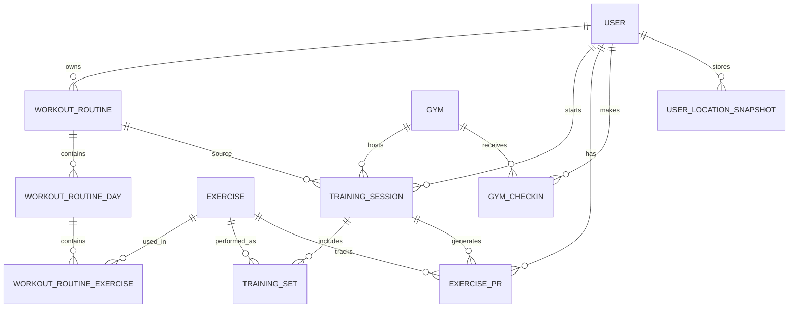
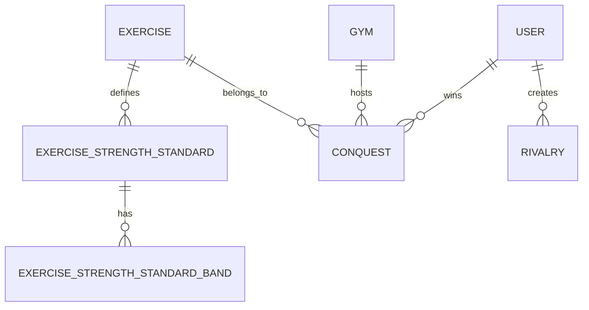
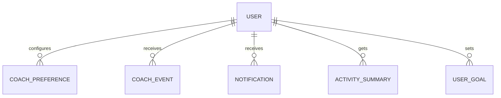
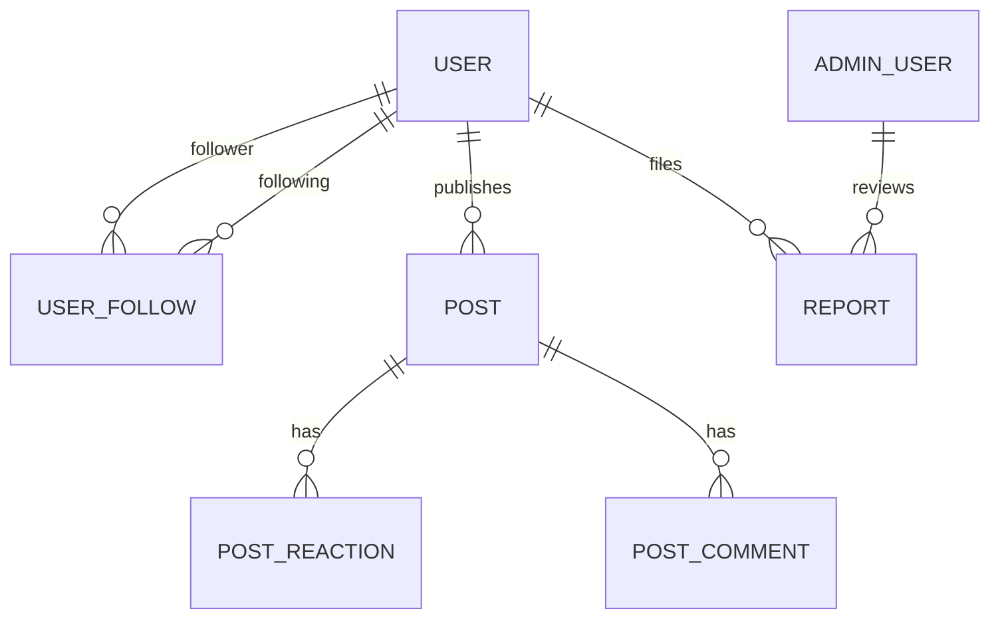
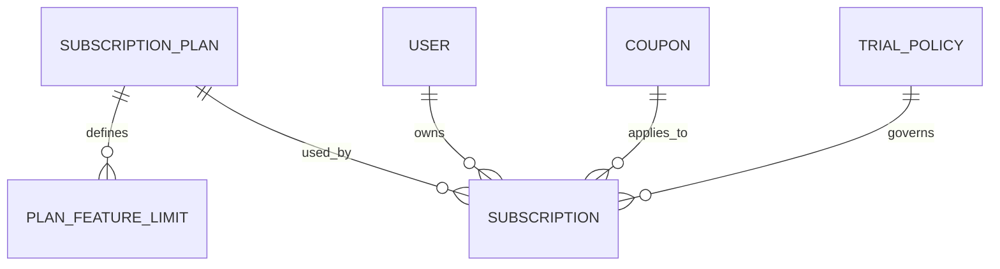
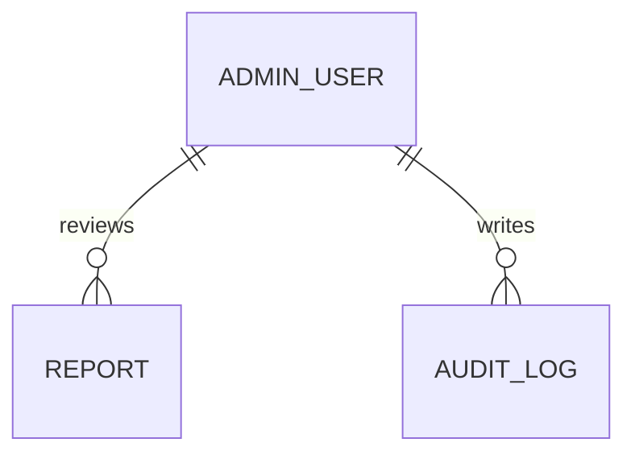

# OlympX MVP 2026 - Modelo Relacional Global

> Vista global de datos para OlympX: producto, social, admin, coach, monetizacion y auditoria.
> Este documento amplía `ModeloRelacionalMVP.md` y sirve para ver el alcance total antes de implementar Prisma o API.

## 1. Objetivo

Definir las entidades y relaciones de todo el ecosistema OlympX para evitar huecos de alcance al sumar producto, admin, coach y revenue.

## 2. Convenciones

- `id` es `uuid` en todas las tablas principales.
- `createdAt` y `updatedAt` se usan en tablas transaccionales.
- `company_uuid` se usa solo donde aplique multi-tenant o segmentacion comercial.
- Los valores monetarios y de peso se guardan en `decimal`.
- Los campos de clasificacion usan `enum` o `varchar` controlado cuando aplique.

## 3. Dominios

| Dominio | Proposito |
|---------|-----------|
| Core producto | Usuarios, gimnasios, ejercicios, rutinas, sesiones, PRs, rangos |
| Social | Seguidores, feed, reacciones, comentarios, reportes |
| Competitivo | Conquistas, rankings, titulos, rivales |
| Retencion | Notificaciones, activity summary, coach, metas |
| Comercial | Planes, trials, suscripciones, cupones, limites Free |
| Operacion | Admin, auditoria, moderacion, estado de sistema |

## 4. Entidades Core

### 4.1 User

| Campo | Tipo | Null | Clave | Descripcion |
|-------|------|------|-------|-------------|
| id | uuid | No | PK | Identificador del usuario |
| email | varchar | No | UQ | Correo unico |
| password | varchar | No | - | Hash de password |
| nickname | varchar | No | UQ | Alias publico |
| name | varchar | Si | - | Nombre visible |
| age | int | Si | - | Edad |
| sex | varchar | Si | - | Sexo del perfil |
| weight | decimal(5,2) | Si | - | Peso corporal en kg |
| height | decimal(5,2) | Si | - | Altura en cm |
| region | varchar | Si | - | Region |
| commune | varchar | Si | - | Comuna |
| level | varchar | Si | - | Nivel fitness |
| avatar | varchar | Si | - | URL o ruta de avatar |
| gymId | uuid | Si | FK | Gimnasio principal |
| status | varchar | No | - | active, suspended, deleted |
| createdAt | timestamptz | No | - | Creacion |
| updatedAt | timestamptz | No | - | Actualizacion |

### 4.2 Gym

| Campo | Tipo | Null | Clave | Descripcion |
|-------|------|------|-------|-------------|
| id | uuid | No | PK | Identificador del gimnasio |
| name | varchar | No | - | Nombre comercial |
| address | varchar | Si | - | Direccion |
| lat | decimal(10,7) | Si | - | Latitud |
| lng | decimal(10,7) | Si | - | Longitud |
| chain | varchar | Si | - | Cadena o franquicia |
| city | varchar | Si | - | Ciudad |
| region | varchar | Si | - | Region |
| verified | boolean | No | - | Si esta verificado |
| status | varchar | No | - | active, inactive |
| createdAt | timestamptz | No | - | Creacion |
| updatedAt | timestamptz | No | - | Actualizacion |

### 4.3 Exercise

| Campo | Tipo | Null | Clave | Descripcion |
|-------|------|------|-------|-------------|
| id | uuid | No | PK | Identificador del ejercicio |
| name | varchar | No | - | Nombre del ejercicio |
| muscleGroup | varchar | Si | - | Grupo muscular |
| exerciseType | varchar | Si | - | Tipo de ejercicio |
| muscleCategory | varchar | Si | - | Categoria muscular |
| image | varchar | Si | - | Imagen de referencia |
| competitive | boolean | No | - | Si participa en competencia |
| status | varchar | No | - | active, inactive |
| createdAt | timestamptz | No | - | Creacion |
| updatedAt | timestamptz | No | - | Actualizacion |

### 4.4 WorkoutRoutine

| Campo | Tipo | Null | Clave | Descripcion |
|-------|------|------|-------|-------------|
| id | uuid | No | PK | Rutina del usuario |
| userId | uuid | No | FK | Dueno de la rutina |
| name | varchar | No | - | Nombre de la rutina |
| description | text | Si | - | Descripcion opcional |
| isTemplate | boolean | No | - | Marca si se puede reutilizar |
| createdAt | timestamptz | No | - | Creacion |
| updatedAt | timestamptz | No | - | Actualizacion |

### 4.5 WorkoutRoutineDay

| Campo | Tipo | Null | Clave | Descripcion |
|-------|------|------|-------|-------------|
| id | uuid | No | PK | Dia de la rutina |
| routineId | uuid | No | FK | Rutina padre |
| dayOfWeek | smallint | No | - | 1-7 o 0-6 |
| sortOrder | int | No | - | Orden visual |

### 4.6 WorkoutRoutineExercise

| Campo | Tipo | Null | Clave | Descripcion |
|-------|------|------|-------|-------------|
| id | uuid | No | PK | Ejercicio dentro del dia |
| routineDayId | uuid | No | FK | Dia padre |
| exerciseId | uuid | No | FK | Ejercicio catalogado |
| sortOrder | int | No | - | Orden del ejercicio |
| targetSets | int | Si | - | Series objetivo |
| targetReps | int | Si | - | Reps objetivo |
| targetWeightKg | decimal(6,2) | Si | - | Peso objetivo |
| restSeconds | int | Si | - | Descanso sugerido |
| notes | text | Si | - | Notas |

### 4.7 TrainingSession

| Campo | Tipo | Null | Clave | Descripcion |
|-------|------|------|-------|-------------|
| id | uuid | No | PK | Sesion de entrenamiento |
| userId | uuid | No | FK | Usuario que entrena |
| gymId | uuid | Si | FK | Gimnasio de la sesion |
| routineId | uuid | Si | FK | Rutina aplicada, si existe |
| startedAt | timestamptz | No | - | Inicio |
| endedAt | timestamptz | Si | - | Fin |
| status | varchar | No | - | draft, active, finished, cancelled |
| notes | text | Si | - | Notas generales |
| totalVolumeKg | decimal(10,2) | Si | - | Tonelaje total |
| source | varchar | Si | - | manual, routine, import |

### 4.8 TrainingSet

| Campo | Tipo | Null | Clave | Descripcion |
|-------|------|------|-------|-------------|
| id | uuid | No | PK | Set individual |
| sessionId | uuid | No | FK | Sesion padre |
| exerciseId | uuid | No | FK | Ejercicio realizado |
| setNumber | int | No | - | Numero de set |
| weightKg | decimal(6,2) | No | - | Peso usado |
| reps | int | No | - | Repeticiones |
| rpe | decimal(3,1) | Si | - | Esfuerzo percibido |
| rir | decimal(3,1) | Si | - | Reps en reserva |
| isWarmup | boolean | No | - | Si es calentamiento |
| isCompetitive | boolean | No | - | Si entra a rankings/conquistas |
| estimated1rmKg | decimal(6,2) | Si | - | 1RM estimado |
| createdAt | timestamptz | No | - | Creacion |

### 4.9 ExercisePR

| Campo | Tipo | Null | Clave | Descripcion |
|-------|------|------|-------|-------------|
| id | uuid | No | PK | Marca personal |
| userId | uuid | No | FK | Usuario |
| exerciseId | uuid | No | FK | Ejercicio |
| prType | varchar | No | - | one_rep_max, reps_fixed_weight, etc. |
| valueKg | decimal(6,2) | No | - | Valor principal del PR |
| reps | int | Si | - | Reps asociadas |
| estimated1rmKg | decimal(6,2) | Si | - | 1RM estimado |
| sourceSessionId | uuid | Si | FK | Sesion que genero el PR |
| achievedAt | timestamptz | No | - | Fecha del PR |

### 4.10 GymCheckin

| Campo | Tipo | Null | Clave | Descripcion |
|-------|------|------|-------|-------------|
| id | uuid | No | PK | Check-in |
| userId | uuid | No | FK | Usuario |
| gymId | uuid | No | FK | Gimnasio |
| checkedInAt | timestamptz | No | - | Momento de ingreso |
| checkedOutAt | timestamptz | Si | - | Momento de salida |
| sourceLat | decimal(10,7) | Si | - | Latitud detectada |
| sourceLng | decimal(10,7) | Si | - | Longitud detectada |
| isValid | boolean | No | - | Validez del check-in |

### 4.11 UserFollow

| Campo | Tipo | Null | Clave | Descripcion |
|-------|------|------|-------|-------------|
| followerId | uuid | No | PK/FK | Usuario que sigue |
| followingId | uuid | No | PK/FK | Usuario seguido |
| createdAt | timestamptz | No | - | Creacion |

### 4.12 UserLocationSnapshot

| Campo | Tipo | Null | Clave | Descripcion |
|-------|------|------|-------|-------------|
| id | uuid | No | PK | Snapshot de ubicacion |
| userId | uuid | No | FK | Usuario |
| source | varchar | No | - | gps, manual, gym_checkin, last_known |
| lat | decimal(10,7) | No | - | Latitud |
| lng | decimal(10,7) | No | - | Longitud |
| accuracyMeters | decimal(8,2) | Si | - | Precision reportada |
| capturedAt | timestamptz | No | - | Momento |
| isLastKnown | boolean | No | - | Ubicacion utilizable |

## 5. Rangos Y Competencia

### 5.1 ExerciseStrengthStandard

| Campo | Tipo | Null | Clave | Descripcion |
|-------|------|------|-------|-------------|
| id | uuid | No | PK | Tabla maestra por ejercicio y sexo |
| exerciseId | uuid | No | FK | Ejercicio |
| sex | varchar | No | - | male, female, other a definir |
| source | varchar | Si | - | Fuente de evidencia |
| version | varchar | Si | - | Version del estandar |
| isActive | boolean | No | - | Estandar vigente |
| createdAt | timestamptz | No | - | Creacion |
| updatedAt | timestamptz | No | - | Actualizacion |

### 5.2 ExerciseStrengthStandardBand

| Campo | Tipo | Null | Clave | Descripcion |
|-------|------|------|-------|-------------|
| id | uuid | No | PK | Banda de rango |
| standardId | uuid | No | FK | Estandar padre |
| rankKey | varchar | No | - | bronze, silver, gold, platinum, diamond |
| rankName | varchar | No | - | Nombre visible |
| min1rmKg | decimal(6,2) | No | - | Minimo del rango |
| max1rmKg | decimal(6,2) | Si | - | Maximo del rango |
| percentileMin | decimal(5,2) | Si | - | Percentil minimo |
| percentileMax | decimal(5,2) | Si | - | Percentil maximo |
| sortOrder | int | No | - | Orden ascendente |
| colorToken | varchar | Si | - | Token visual |

### 5.3 Conquest

| Campo | Tipo | Null | Clave | Descripcion |
|-------|------|------|-------|-------------|
| id | uuid | No | PK | Conquista semanal |
| gymId | uuid | No | FK | Gimnasio |
| exerciseId | uuid | No | FK | Ejercicio |
| userId | uuid | No | FK | Campeon |
| rankCategory | varchar | No | - | general, age, sex, weight, imc |
| weekStart | date | No | - | Inicio de semana |
| weekEnd | date | No | - | Fin de semana |
| metricType | varchar | No | - | 1rm, reps, volume, relative |
| metricValue | decimal(10,2) | No | - | Valor que gano la conquista |
| createdAt | timestamptz | No | - | Creacion |

### 5.4 Rivalry

| Campo | Tipo | Null | Clave | Descripcion |
|-------|------|------|-------|-------------|
| id | uuid | No | PK | Rivalidad |
| userId | uuid | No | FK | Usuario origen |
| rivalUserId | uuid | No | FK | Usuario rival |
| status | varchar | No | - | active, hidden |
| createdAt | timestamptz | No | - | Creacion |

## 6. Retencion Y Coach

### 6.1 UserGoal

| Campo | Tipo | Null | Clave | Descripcion |
|-------|------|------|-------|-------------|
| id | uuid | No | PK | Meta del usuario |
| userId | uuid | No | FK | Usuario |
| goalType | varchar | No | - | adherence, frequency, volume, pr |
| targetValue | decimal(10,2) | No | - | Valor objetivo |
| period | varchar | No | - | weekly, monthly |
| status | varchar | No | - | active, achieved, cancelled |
| createdAt | timestamptz | No | - | Creacion |

### 6.2 CoachPreference

| Campo | Tipo | Null | Clave | Descripcion |
|-------|------|------|-------|-------------|
| id | uuid | No | PK | Preferencia del coach |
| userId | uuid | No | FK | Usuario |
| coachEnabled | boolean | No | - | Coach activo |
| tone | varchar | No | - | direct, motivational, neutral |
| nudgesIntensity | varchar | No | - | low, medium, high |
| quietHoursStart | time | Si | - | Inicio de silencio |
| quietHoursEnd | time | Si | - | Fin de silencio |
| weeklyGoalsEnabled | boolean | No | - | Metas activas |
| createdAt | timestamptz | No | - | Creacion |
| updatedAt | timestamptz | No | - | Actualizacion |

### 6.3 CoachEvent

| Campo | Tipo | Null | Clave | Descripcion |
|-------|------|------|-------|-------------|
| id | uuid | No | PK | Evento de coach |
| userId | uuid | No | FK | Usuario |
| eventType | varchar | No | - | refuerzo, nudge, streak_alert, goal, recovery |
| triggerCode | varchar | No | - | CT-001 ... CT-008 |
| messageKey | varchar | No | - | Clave de copy |
| tone | varchar | No | - | direct, motivational, neutral |
| status | varchar | No | - | sent, scheduled, dismissed |
| scheduledAt | timestamptz | Si | - | Programado |
| sentAt | timestamptz | Si | - | Enviado |

## 7. Notificaciones Y Resumenes

### 7.1 Notification

| Campo | Tipo | Null | Clave | Descripcion |
|-------|------|------|-------|-------------|
| id | uuid | No | PK | Notificacion |
| userId | uuid | No | FK | Destinatario |
| type | varchar | No | - | conquest, pr, reaction, ranking, coach |
| title | varchar | No | - | Titulo visible |
| body | text | No | - | Cuerpo |
| isRead | boolean | No | - | Leida o no |
| createdAt | timestamptz | No | - | Creacion |
| readAt | timestamptz | Si | - | Lectura |

### 7.2 ActivitySummary

| Campo | Tipo | Null | Clave | Descripcion |
|-------|------|------|-------|-------------|
| id | uuid | No | PK | Resumen compartible |
| userId | uuid | No | FK | Usuario |
| summaryType | varchar | No | - | session, weekly, conquest, pr |
| title | varchar | No | - | Titulo |
| body | text | No | - | Texto corto |
| metricsJson | jsonb | Si | - | Metricas destacadas |
| mediaUrl | varchar | Si | - | Imagen o card |
| createdAt | timestamptz | No | - | Creacion |

## 8. Social Y Moderacion

### 8.1 Post

| Campo | Tipo | Null | Clave | Descripcion |
|-------|------|------|-------|-------------|
| id | uuid | No | PK | Publicacion |
| userId | uuid | No | FK | Autor |
| postType | varchar | No | - | story, pr, conquest, workout, progress |
| body | text | Si | - | Texto |
| mediaUrl | varchar | Si | - | Media |
| expiresAt | timestamptz | Si | - | Expiracion |
| createdAt | timestamptz | No | - | Creacion |

### 8.2 PostReaction

| Campo | Tipo | Null | Clave | Descripcion |
|-------|------|------|-------|-------------|
| id | uuid | No | PK | Reaccion |
| postId | uuid | No | FK | Publicacion |
| userId | uuid | No | FK | Usuario |
| reactionType | varchar | No | - | bestial, good_form, keep_going, dominated, disapprove, funny |
| createdAt | timestamptz | No | - | Creacion |

### 8.3 PostComment

| Campo | Tipo | Null | Clave | Descripcion |
|-------|------|------|-------|-------------|
| id | uuid | No | PK | Comentario |
| postId | uuid | No | FK | Publicacion |
| userId | uuid | No | FK | Autor |
| body | text | No | - | Comentario |
| createdAt | timestamptz | No | - | Creacion |

### 8.4 Report

| Campo | Tipo | Null | Clave | Descripcion |
|-------|------|------|-------|-------------|
| id | uuid | No | PK | Reporte |
| reporterUserId | uuid | No | FK | Quien reporta |
| targetType | varchar | No | - | user, post, comment |
| targetId | uuid | No | - | Id del objetivo |
| reason | varchar | No | - | Motivo |
| status | varchar | No | - | pending, reviewed, rejected, closed |
| notes | text | Si | - | Observaciones |
| reviewedBy | uuid | Si | FK | Admin |
| reviewedAt | timestamptz | Si | - | Revision |
| createdAt | timestamptz | No | - | Creacion |

## 9. Comercial

### 9.1 SubscriptionPlan

| Campo | Tipo | Null | Clave | Descripcion |
|-------|------|------|-------|-------------|
| id | uuid | No | PK | Plan |
| code | varchar | No | UQ | free, paid_monthly, paid_annual |
| name | varchar | No | - | Nombre visible |
| priceMonthly | decimal(10,2) | Si | - | Precio mensual |
| priceAnnual | decimal(10,2) | Si | - | Precio anual |
| currency | varchar | No | - | CLP, USD, etc |
| isActive | boolean | No | - | Plan vigente |
| createdAt | timestamptz | No | - | Creacion |
| updatedAt | timestamptz | No | - | Actualizacion |

### 9.2 PlanFeatureLimit

| Campo | Tipo | Null | Clave | Descripcion |
|-------|------|------|-------|-------------|
| id | uuid | No | PK | Limite por plan |
| planId | uuid | No | FK | Plan |
| featureKey | varchar | No | - | sessions, history, pdf, rankings, etc |
| limitValue | int | Si | - | Valor numerico |
| isEnabled | boolean | No | - | Habilitado o no |
| createdAt | timestamptz | No | - | Creacion |

### 9.3 TrialPolicy

| Campo | Tipo | Null | Clave | Descripcion |
|-------|------|------|-------|-------------|
| id | uuid | No | PK | Politica de trial |
| isEnabled | boolean | No | - | Trial activo |
| durationDays | int | No | - | Dias de trial |
| requiresCard | boolean | No | - | Requiere tarjeta |
| maxPerUser | int | No | - | Maximo por usuario |
| maxPerCard | int | No | - | Maximo por tarjeta |
| createdAt | timestamptz | No | - | Creacion |
| updatedAt | timestamptz | No | - | Actualizacion |

### 9.4 Subscription

| Campo | Tipo | Null | Clave | Descripcion |
|-------|------|------|-------|-------------|
| id | uuid | No | PK | Suscripcion |
| userId | uuid | No | FK | Usuario |
| planId | uuid | No | FK | Plan |
| couponId | uuid | Si | FK | Cupón aplicado |
| status | varchar | No | - | trialing, active, canceled, expired |
| startedAt | timestamptz | No | - | Inicio |
| endsAt | timestamptz | Si | - | Fin |
| canceledAt | timestamptz | Si | - | Cancelacion |
| cancelReason | varchar | Si | - | Motivo |
| createdAt | timestamptz | No | - | Creacion |
| updatedAt | timestamptz | No | - | Actualizacion |

### 9.5 Coupon

| Campo | Tipo | Null | Clave | Descripcion |
|-------|------|------|-------|-------------|
| id | uuid | No | PK | Cupon |
| code | varchar | No | UQ | Codigo |
| discountType | varchar | No | - | percent, fixed |
| discountValue | decimal(10,2) | No | - | Valor descuento |
| maxRedemptions | int | Si | - | Limite total |
| maxPerUser | int | Si | - | Limite por usuario |
| expiresAt | timestamptz | Si | - | Expiracion |
| isActive | boolean | No | - | Activo |
| createdAt | timestamptz | No | - | Creacion |

### 9.6 FreeSignupCap

Configuracion singleton de negocio para controlar el cupo de nuevas altas Free y el fallback a trial.

| Campo | Tipo | Null | Clave | Descripcion |
|-------|------|------|-------|-------------|
| id | uuid | No | PK | Cupo Free |
| maxActiveFreeSignups | int | No | - | Tope configurable |
| currentActiveFreeSignups | int | No | - | Contador actual |
| trialFallbackEnabled | boolean | No | - | Si al llegar al tope solo ofrece trial |
| updatedAt | timestamptz | No | - | Actualizacion |

## 10. Admin Y Auditoria

### 10.1 AdminUser

| Campo | Tipo | Null | Clave | Descripcion |
|-------|------|------|-------|-------------|
| id | uuid | No | PK | Usuario interno |
| email | varchar | No | UQ | Login interno |
| password | varchar | No | - | Hash |
| role | varchar | No | - | admin, super_admin, moderator, support |
| status | varchar | No | - | active, inactive |
| createdAt | timestamptz | No | - | Creacion |
| updatedAt | timestamptz | No | - | Actualizacion |

### 10.2 AuditLog

| Campo | Tipo | Null | Clave | Descripcion |
|-------|------|------|-------|-------------|
| id | uuid | No | PK | Registro auditable |
| actorType | varchar | No | - | admin, system |
| actorId | uuid | Si | - | Quien ejecuta |
| action | varchar | No | - | suspension, plan_update, moderation, coupon_update |
| entityType | varchar | No | - | user, gym, plan, report, coupon |
| entityId | uuid | No | - | Id afectado |
| beforeJson | jsonb | Si | - | Estado previo |
| afterJson | jsonb | Si | - | Estado posterior |
| createdAt | timestamptz | No | - | Creacion |

## 11. Relaciones Por Dominio

### 11.1 Core Producto

### 11.2 Competitivo Y Rangos

### 11.3 Retencion Y Coach

### 11.4 Social Y Moderacion

### 11.5 Comercial

> `FREE_SIGNUP_CAP` se maneja como configuracion singleton de negocio, no como relacion fisica obligatoria.

### 11.6 Operacion Y Auditoria

## 12. Alcance MVP Vs Global

| Dominio | MVP | Global |
|---------|-----|--------|
| Core producto | Si | Si |
| Rangos y competencia | Si | Si |
| Social | Parcial | Si |
| Notificaciones | Parcial | Si |
| Coach | No base | Si |
| Comercial | Parcial | Si |
| Admin | Parcial | Si |
| Auditoria | Basico | Si |

## 13. Pendientes De Implementacion

- Definir enums finales de `status`, `role`, `eventType` y `featureKey`.
- Alinear `company_uuid` si se requiere multi-tenant real en la app comercial.
- Llevar este modelo a Prisma por fases, comenzando por core, comercio y auditoria.
