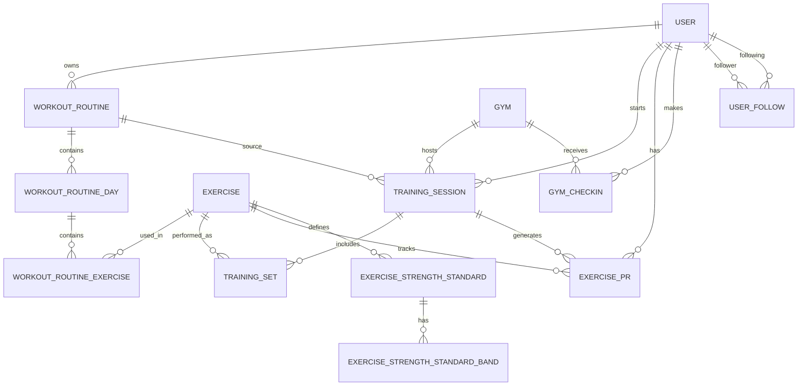

# OlympX MVP 2026 - Modelo Relacional

> Borrador para revisar campos y relaciones antes de implementar Prisma/API.
> Enfocado en el MVP y en el nuevo modulo de rangos de fuerza universales.

## 1. Alcance

Este documento muestra:
- Entidades ya presentes en `olympx-api/prisma/schema.prisma`.
- Entidades que faltan para cubrir registros, PRs, rankings y rangos de fuerza.
- Relaciones principales para validar campos, llaves y cardinalidades.

## 2. Convenciones

- `id` es `uuid` en todas las tablas principales.
- `createdAt` y `updatedAt` se usan en tablas transaccionales.
- Los valores monetarios o de peso se guardan en kilos con `decimal`.
- Los campos de clasificacion usan `enum` cuando aplique.

## 3. Entidades Actuales

### 3.1 User

| Campo | Tipo | Null | Clave | Descripcion |
|-------|------|------|-------|-------------|
| id | uuid | No | PK | Identificador del usuario |
| email | varchar | No | UQ | Correo unico |
| password | varchar | No | - | Hash de password |
| nickname | varchar | No | UQ | Alias publico |
| name | varchar | Si | - | Nombre visible |
| age | int | Si | - | Edad |
| sex | varchar | Si | - | Sexo del perfil |
| weight | decimal(5,2) | Si | - | Peso corporal en kg |
| height | decimal(5,2) | Si | - | Altura en cm |
| region | varchar | Si | - | Region |
| commune | varchar | Si | - | Comuna |
| level | varchar | Si | - | Nivel fitness |
| avatar | varchar | Si | - | URL o ruta de avatar |
| gymId | uuid | Si | FK | Gimnasio principal |
| createdAt | timestamptz | No | - | Creacion |
| updatedAt | timestamptz | No | - | Actualizacion |

### 3.2 Gym

| Campo | Tipo | Null | Clave | Descripcion |
|-------|------|------|-------|-------------|
| id | uuid | No | PK | Identificador del gimnasio |
| name | varchar | No | - | Nombre comercial |
| address | varchar | Si | - | Direccion |
| lat | decimal(10,7) | Si | - | Latitud |
| lng | decimal(10,7) | Si | - | Longitud |
| chain | varchar | Si | - | Cadena o franquicia |
| city | varchar | Si | - | Ciudad |
| region | varchar | Si | - | Region |
| createdAt | timestamptz | No | - | Creacion |
| updatedAt | timestamptz | No | - | Actualizacion |

### 3.3 Exercise

| Campo | Tipo | Null | Clave | Descripcion |
|-------|------|------|-------|-------------|
| id | uuid | No | PK | Identificador del ejercicio |
| name | varchar | No | - | Nombre del ejercicio |
| muscleGroup | varchar | Si | - | Grupo muscular |
| exerciseType | varchar | Si | - | Tipo de ejercicio |
| muscleCategory | varchar | Si | - | Categoria muscular |
| image | varchar | Si | - | Imagen de referencia |
| competitive | boolean | No | - | Si participa en competencia |
| createdAt | timestamptz | No | - | Creacion |
| updatedAt | timestamptz | No | - | Actualizacion |

## 4. Entidades Propuestas MVP

### 4.1 WorkoutRoutine

| Campo | Tipo | Null | Clave | Descripcion |
|-------|------|------|-------|-------------|
| id | uuid | No | PK | Rutina del usuario |
| userId | uuid | No | FK | Dueno de la rutina |
| name | varchar | No | - | Nombre de la rutina |
| description | text | Si | - | Descripcion opcional |
| isTemplate | boolean | No | - | Marca si se puede reutilizar |
| createdAt | timestamptz | No | - | Creacion |
| updatedAt | timestamptz | No | - | Actualizacion |

### 4.2 WorkoutRoutineDay

| Campo | Tipo | Null | Clave | Descripcion |
|-------|------|------|-------|-------------|
| id | uuid | No | PK | Dia de la rutina |
| routineId | uuid | No | FK | Rutina padre |
| dayOfWeek | smallint | No | - | 1-7 o 0-6, a definir |
| sortOrder | int | No | - | Orden visual |

### 4.3 WorkoutRoutineExercise

| Campo | Tipo | Null | Clave | Descripcion |
|-------|------|------|-------|-------------|
| id | uuid | No | PK | Ejercicio dentro del dia |
| routineDayId | uuid | No | FK | Dia padre |
| exerciseId | uuid | No | FK | Ejercicio catalogado |
| sortOrder | int | No | - | Orden del ejercicio |
| targetSets | int | Si | - | Series objetivo |
| targetReps | int | Si | - | Reps objetivo |
| targetWeightKg | decimal(6,2) | Si | - | Peso objetivo |
| restSeconds | int | Si | - | Descanso sugerido |
| notes | text | Si | - | Notas |

### 4.4 TrainingSession

| Campo | Tipo | Null | Clave | Descripcion |
|-------|------|------|-------|-------------|
| id | uuid | No | PK | Sesion de entrenamiento |
| userId | uuid | No | FK | Usuario que entrena |
| gymId | uuid | Si | FK | Gimnasio de la sesion |
| routineId | uuid | Si | FK | Rutina aplicada, si existe |
| startedAt | timestamptz | No | - | Inicio |
| endedAt | timestamptz | Si | - | Fin |
| status | varchar | No | - | draft, active, finished, cancelled |
| notes | text | Si | - | Notas generales |
| totalVolumeKg | decimal(10,2) | Si | - | Tonelaje total |
| source | varchar | Si | - | manual, routine, import |

### 4.5 TrainingSet

| Campo | Tipo | Null | Clave | Descripcion |
|-------|------|------|-------|-------------|
| id | uuid | No | PK | Set individual |
| sessionId | uuid | No | FK | Sesion padre |
| exerciseId | uuid | No | FK | Ejercicio realizado |
| setNumber | int | No | - | Numero de set |
| weightKg | decimal(6,2) | No | - | Peso usado |
| reps | int | No | - | Repeticiones |
| rpe | decimal(3,1) | Si | - | Esfuerzo percibido |
| rir | decimal(3,1) | Si | - | Reps en reserva |
| isWarmup | boolean | No | - | Si es calentamiento |
| isCompetitive | boolean | No | - | Si entra a rankings/conquistas |
| estimated1rmKg | decimal(6,2) | Si | - | 1RM estimado |
| createdAt | timestamptz | No | - | Creacion |

### 4.6 ExercisePR

| Campo | Tipo | Null | Clave | Descripcion |
|-------|------|------|-------|-------------|
| id | uuid | No | PK | Marca personal |
| userId | uuid | No | FK | Usuario |
| exerciseId | uuid | No | FK | Ejercicio |
| prType | varchar | No | - | one_rep_max, reps_fixed_weight, etc. |
| valueKg | decimal(6,2) | No | - | Valor principal del PR |
| reps | int | Si | - | Reps asociadas, si aplica |
| estimated1rmKg | decimal(6,2) | Si | - | 1RM estimado |
| sourceSessionId | uuid | Si | FK | Sesion que genero el PR |
| achievedAt | timestamptz | No | - | Fecha del PR |

### 4.7 GymCheckin

| Campo | Tipo | Null | Clave | Descripcion |
|-------|------|------|-------|-------------|
| id | uuid | No | PK | Check-in |
| userId | uuid | No | FK | Usuario |
| gymId | uuid | No | FK | Gimnasio |
| checkedInAt | timestamptz | No | - | Momento de ingreso |
| checkedOutAt | timestamptz | Si | - | Momento de salida |
| sourceLat | decimal(10,7) | Si | - | Latitud detectada |
| sourceLng | decimal(10,7) | Si | - | Longitud detectada |
| isValid | boolean | No | - | Validez del check-in |

### 4.8 UserFollow

| Campo | Tipo | Null | Clave | Descripcion |
|-------|------|------|-------|-------------|
| followerId | uuid | No | PK/FK | Usuario que sigue |
| followingId | uuid | No | PK/FK | Usuario seguido |
| createdAt | timestamptz | No | - | Creacion |

### 4.9 UserLocationSnapshot

| Campo | Tipo | Null | Clave | Descripcion |
|-------|------|------|-------|-------------|
| id | uuid | No | PK | Snapshot de ubicacion del usuario |
| userId | uuid | No | FK | Usuario |
| source | varchar | No | - | gps, manual, gym_checkin, last_known |
| lat | decimal(10,7) | No | - | Latitud |
| lng | decimal(10,7) | No | - | Longitud |
| accuracyMeters | decimal(8,2) | Si | - | Precision reportada |
| capturedAt | timestamptz | No | - | Momento en que se obtuvo |
| isLastKnown | boolean | No | - | Marca la ubicacion mas reciente utilizable |

### 4.10 ExerciseStrengthStandard

| Campo | Tipo | Null | Clave | Descripcion |
|-------|------|------|-------|-------------|
| id | uuid | No | PK | Tabla maestra por ejercicio y sexo |
| exerciseId | uuid | No | FK | Ejercicio |
| sex | varchar | No | - | male, female, other a definir |
| source | varchar | Si | - | Fuente de evidencia |
| version | varchar | Si | - | Version del estandar |
| isActive | boolean | No | - | Estandar vigente |
| createdAt | timestamptz | No | - | Creacion |
| updatedAt | timestamptz | No | - | Actualizacion |

### 4.11 ExerciseStrengthStandardBand

| Campo | Tipo | Null | Clave | Descripcion |
|-------|------|------|-------|-------------|
| id | uuid | No | PK | Banda de rango |
| standardId | uuid | No | FK | Estandar padre |
| rankKey | varchar | No | - | bronze, silver, gold, platinum, diamond |
| rankName | varchar | No | - | Nombre visible |
| min1rmKg | decimal(6,2) | No | - | Minimo del rango |
| max1rmKg | decimal(6,2) | Si | - | Maximo del rango |
| percentileMin | decimal(5,2) | Si | - | Percentil minimo |
| percentileMax | decimal(5,2) | Si | - | Percentil maximo |
| sortOrder | int | No | - | Orden ascendente |
| colorToken | varchar | Si | - | Token visual |

## 5. Relaciones Principales

## 6. Campos A Revisar

Estos son los puntos que conviene validar antes de pasar a Prisma:
- `User.sex`: si sera `male/female/other` o si el ranking de fuerza usa solo `male/female`.
- `TrainingSet.rpe` y `TrainingSet.rir`: si se guardan como decimal o entero.
- `TrainingSession.status`: lista cerrada de estados.
- `ExerciseStrengthStandardBand.max1rmKg`: si el ultimo rango queda abierto o cerrado.
- `percentileMin` y `percentileMax`: si se guardan como porcentaje entero o decimal.
- `colorToken`: si el frontend usa tokens de tema o valores fijos.

## 7. Reglas De Modelado

- Un `Exercise` puede tener multiples PRs, pero solo uno vigente por tipo de PR si se quiere normalizar mas tarde.
- Un `TrainingSession` puede existir sin rutina asociada.
- Un `TrainingSet` debe referenciar un `Exercise` existente.
- Los rangos de fuerza son por `exerciseId + sex + version`.
- Los ejercicios del MVP deben cargarse como semilla inicial.

## 8. Ejercicios Iniciales Para Rangos

- Press banca
- Sentadilla
- Peso muerto
- Dominadas
- Press militar
- Curl de biceps
- Fondos con lastre
- Curl isquiotibial
- Leg extension
- Hip thrust
- Jalon al pecho
- Remo barra libre

## 9. Pendientes Fuera De Este Borrador

- Conquistas semanales.
- Feed social.
- Notificaciones.
- Rivalidades y top del dia.
