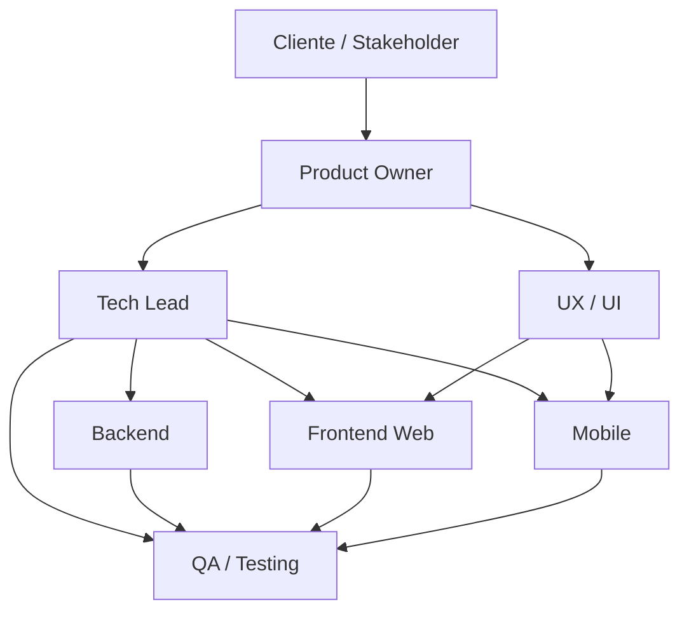

# OlympX - Organigrama MVP

> Vista ejecutiva del equipo y dependencias para el MVP.

## Roles

- Product Owner: prioriza alcance, valida negocio y aprueba entregables.
- Tech Lead: define arquitectura, orden tecnico y riesgos.
- UX/UI: flujos, wireframes y experiencia mobile-first.
- Backend: API, datos, auth, negocio y reglas.
- Frontend Web: landing, soporte comercial y pantallas web.
- Mobile: app principal del usuario final.
- QA: validacion funcional, regresion y estabilidad.
