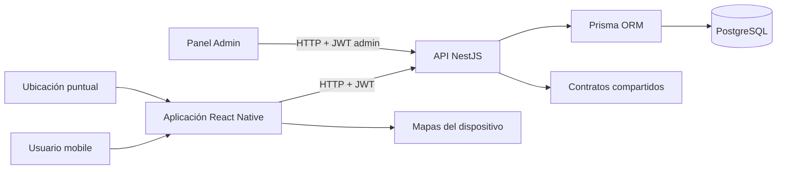

# Etapa 3 - Especificación Técnica

## 1. Propósito

La Etapa 3 implementa el contexto físico básico de OlympX y la biblioteca que permite identificar los ejercicios que se utilizarán en las etapas de entrenamiento posteriores.

El desarrollo se divide en dos dominios:

1. Gimnasios, ubicación contextual y check-in.
2. Biblioteca pública de ejercicios y sus metadatos.

La entrega se considera completada con el alcance aprobado. El equipamiento no se incorpora en esta etapa y queda planificado para una etapa posterior.

## 2. Alcance Técnico Entregado

### 2.1 Gimnasios Y Contexto Geográfico

Se implementó el catálogo de gimnasios con información pública, búsqueda de gimnasios cercanos, detalle de cada gimnasio, selección del gimnasio principal y registro de check-in mediante la ubicación puntual del dispositivo.

El sistema no realiza seguimiento continuo segundo a segundo. La ubicación se solicita únicamente cuando una operación la necesita, principalmente para buscar gimnasios cercanos o confirmar un check-in.

### 2.2 Biblioteca De Ejercicios

Se implementó una biblioteca consultable desde API y mobile. Cada ejercicio puede tener nombre, grupo muscular, tipo de ejercicio, categoría muscular, imagen opcional y estado competitivo.

La biblioteca permite:

- Buscar por nombre.
- Filtrar por grupo muscular.
- Filtrar por tipo de ejercicio.
- Filtrar por categoría muscular.
- Consultar el detalle de un ejercicio.
- Identificar si un ejercicio es competitivo.
- Consumir el ejercicio desde los flujos de entrenamiento posteriores.

El atributo de equipamiento no se agrega al modelo de esta entrega. Su incorporación queda expresamente reservada para una etapa futura.

## 3. Arquitectura De La Solución



### 3.1 API

La API está implementada con NestJS y utiliza Prisma para acceder a PostgreSQL. Las respuestas siguen el contrato común de OlympX:

```json
{
  "ok": true,
  "data": {},
  "message": "",
  "statusCode": 200
}
```

Los módulos principales de la etapa son:

- `olympx-api/src/modules/gyms/`.
- `olympx-api/src/modules/exercises/`.
- `olympx-api/src/modules/users/` para ubicación y gimnasio principal.
- `olympx-api/src/modules/admin/` para la administración de gimnasios y catálogo.

### 3.2 Mobile

Las pantallas principales son:

- `SearchScreen`: búsqueda manual y búsqueda contextual de gimnasios.
- `GymDetailScreen`: detalle, gimnasio principal, check-in, actividad y mapas.
- `ExerciseLibraryScreen`: búsqueda, filtros, listado y detalle de ejercicios.
- `HomeScreen`: acceso a gimnasios sugeridos y contexto de entrenamiento.
- `ProfileScreen`: consulta del historial de check-ins del usuario.

### 3.3 Contratos Compartidos

El paquete `olympx-contracts` evita que API y mobile definan estructuras diferentes. Para esta etapa se incorporaron o utilizaron contratos para:

- `GymSummary`.
- `GymDetail`.
- `UserLocation`.
- `UpdatePrimaryGymRequest`.
- `GymCheckInRequest`.
- `GymCheckInResponse`.
- `GymActivityResponse`.
- `ExerciseSummary`.
- `ExerciseDetail`.
- `ExerciseStrengthRangeItem`.
- `GymVerificationStatus`.

## 4. Modelo De Datos

### 4.1 Usuario Y Ubicación

El modelo `User` conserva el contexto de ubicación más reciente:

- `lastLocationLat`.
- `lastLocationLng`.
- `lastLocationAccuracy`.
- `lastLocationAt`.
- `gymId` como referencia al gimnasio principal.

La ubicación queda asociada al usuario para mantener contexto entre acciones, pero no se utiliza como tracking continuo.

### 4.2 Gimnasio

El modelo `Gym` contiene:

- Identificador único.
- Nombre.
- Dirección.
- Latitud y longitud.
- Cadena o marca, cuando corresponde.
- Ciudad y región.
- Estado activo/inactivo.
- Estado de verificación: `PENDING`, `VERIFIED`, `REJECTED` o `DUPLICATE`.
- Nota de revisión administrativa.
- Fechas de creación y actualización.

Las relaciones permiten asociar usuarios, check-ins y sesiones de entrenamiento al gimnasio.

### 4.3 Check-in

El modelo `GymCheckIn` registra:

- Identificador del check-in.
- Usuario que lo realizó.
- Gimnasio asociado.
- Fecha y hora de creación.

Existen índices por usuario y fecha, y por gimnasio y fecha, para consultar historial y actividad reciente de manera eficiente.

### 4.4 Ejercicio

El modelo `Exercise` contiene:

- Identificador único.
- Nombre.
- Grupo muscular.
- Tipo de ejercicio.
- Categoría muscular.
- Imagen opcional.
- Indicador `competitive`.
- Fechas de creación y actualización.

El modelo se relaciona con series de entrenamiento, ejercicios de rutinas, rangos de fuerza, récords personales y logros.

No se agrega un campo de equipamiento en esta etapa. Ese dato se implementará cuando se habilite el alcance de equipamiento definido para la etapa posterior.

## 5. API De Gimnasios

### 5.1 Listado Público

```http
GET /api/gyms
```

Devuelve gimnasios utilizables en las superficies públicas, ordenados por nombre. La respuesta incluye información resumida como nombre, dirección, ciudad, región y cadena.

### 5.2 Búsqueda Cercana

```http
GET /api/gyms/nearby?lat=-33.4489&lng=-70.6693&radius=5000
```

Parámetros:

| Parámetro | Descripción                                               |
| --------- | --------------------------------------------------------- |
| `lat`     | Latitud válida del punto de búsqueda                      |
| `lng`     | Longitud válida del punto de búsqueda                     |
| `radius`  | Radio en metros; por defecto 5.000 y con máximo de 50.000 |

La API:

1. Valida latitud, longitud y radio.
2. Obtiene gimnasios públicos con coordenadas.
3. Calcula la distancia mediante la fórmula de Haversine.
4. Descarta gimnasios fuera del radio solicitado.
5. Ordena los resultados desde el más cercano al más lejano.
6. Devuelve hasta diez resultados.

Los gimnasios sin coordenadas no se presentan como resultados cercanos porque no es posible calcular su distancia.

### 5.3 Detalle De Gimnasio

```http
GET /api/gyms/:id
```

El detalle devuelve:

- Nombre.
- Dirección.
- Ciudad y región.
- Cadena.
- Latitud y longitud.
- Estado activo.
- Estado de verificación.

Estos estados permiten que mobile informe claramente si el gimnasio está disponible para ser seleccionado o utilizado en un check-in.

### 5.4 Actualización De Ubicación

```http
PATCH /api/users/me/location
```

Ejemplo de solicitud:

```json
{
  "lat": -33.4489,
  "lng": -70.6693,
  "accuracy": 12.5,
  "capturedAt": "2026-09-30T12:00:00.000Z"
}
```

La API valida la ubicación y conserva el último punto conocido del usuario.

### 5.5 Gimnasio Principal

```http
PATCH /api/users/me/gym
```

Ejemplo:

```json
{
  "gymId": "gym-uuid"
}
```

La operación guarda el gimnasio elegido como principal del usuario. Mobile muestra posteriormente ese estado en el detalle del gimnasio y en las superficies de perfil o contexto local.

### 5.6 Check-in

```http
POST /api/gyms/:id/check-in
```

Ejemplo:

```json
{
  "lat": -33.4489,
  "lng": -70.6693,
  "accuracy": 8.2
}
```

El flujo de validación es:

1. Autenticar al usuario.
2. Buscar el gimnasio solicitado.
3. Confirmar que esté activo.
4. Confirmar que esté verificado.
5. Confirmar que tenga coordenadas válidas.
6. Validar las coordenadas recibidas desde el dispositivo.
7. Calcular la distancia entre usuario y gimnasio.
8. Rechazar la operación si supera el radio permitido.
9. Verificar que no exista un check-in reciente del mismo usuario en el mismo gimnasio.
10. Crear el check-in y actualizar el gimnasio principal dentro de una transacción.

El radio por defecto es de 0,1 km, equivalente a 100 metros, y puede configurarse mediante `GYM_CHECKIN_RADIUS_KM`.

El bloqueo de duplicados considera los últimos 30 minutos. La transacción utiliza aislamiento serializable para evitar que dos intentos concurrentes creen registros duplicados.

Una respuesta exitosa tiene esta forma:

```json
{
  "ok": true,
  "data": {
    "id": "check-in-uuid",
    "gymId": "gym-uuid",
    "checkedInAt": "2026-09-30T12:00:00.000Z"
  },
  "statusCode": 201
}
```

### 5.7 Actividad Del Gimnasio

```http
GET /api/gyms/:id/activity
```

La respuesta considera una ventana de siete días e incluye:

- Cantidad de check-ins recientes.
- Últimos usuarios públicos que hicieron check-in.
- Publicaciones recientes asociadas al gimnasio.
- Información básica del gimnasio.

Los filtros de privacidad evitan exponer cuentas administrativas, suspendidas o perfiles que no deben aparecer en superficies públicas.

## 6. API De Ejercicios

### 6.1 Listado Y Filtros

```http
GET /api/exercises
```

Parámetros disponibles:

| Parámetro        | Uso                                                     |
| ---------------- | ------------------------------------------------------- |
| `q`              | Busca por nombre sin distinguir mayúsculas y minúsculas |
| `muscleGroup`    | Filtra por grupo muscular                               |
| `exerciseType`   | Filtra por tipo de ejercicio                            |
| `muscleCategory` | Filtra por categoría muscular                           |

Ejemplo:

```http
GET /api/exercises?q=press&muscleGroup=pecho&exerciseType=compound
```

La API ordena los resultados por nombre y limita el listado público a un máximo de 100 elementos para mantener una respuesta controlada.

### 6.2 Detalle De Ejercicio

```http
GET /api/exercises/:id
```

El detalle entrega los metadatos del ejercicio, su estado competitivo, imagen si existe y la información publicada relacionada que esté disponible.

### 6.3 Estado Competitivo

El indicador `competitive` permite distinguir entre:

- Ejercicios que pueden participar en los flujos competitivos del producto.
- Ejercicios generales que sirven como referencia o entrenamiento, pero no deben generar conquistas o rankings competitivos.

La administración del catálogo puede actualizar este estado y dejar registro de auditoría.

## 7. Experiencia Mobile

### 7.1 Búsqueda De Gimnasios

Cuando el usuario busca términos relacionados con gimnasios, mobile:

1. Solicita permiso de ubicación cuando corresponde.
2. Obtiene la ubicación actual de forma puntual.
3. Actualiza la última ubicación válida del usuario.
4. Consulta los gimnasios cercanos.
5. Si no hay ubicación o no existen resultados cercanos, ofrece el catálogo general como alternativa.
6. Permite abrir el detalle de un gimnasio.

La búsqueda manual no depende exclusivamente del GPS, por lo que el usuario puede continuar si no concede el permiso o si el dispositivo no entrega una ubicación válida.

### 7.2 Detalle Y Acciones

Desde `GymDetailScreen` el usuario puede:

- Revisar la información del gimnasio.
- Ver si está disponible.
- Elegirlo como gimnasio principal.
- Solicitar un check-in.
- Consultar la actividad local.
- Abrir su ubicación en Apple Maps o en la aplicación de mapas disponible en Android.

La pantalla mantiene estados de carga, error, gimnasio no disponible, acción en progreso y confirmación de resultado.

### 7.3 Biblioteca

Desde `ExerciseLibraryScreen` el usuario puede:

- Escribir el nombre de un ejercicio.
- Seleccionar grupos musculares.
- Revisar la cantidad de ejercicios disponibles.
- Abrir un ejercicio para ver sus datos.
- Identificar si el ejercicio es competitivo.
- Volver al listado sin perder el contexto general.

La biblioteca contempla carga, error, lista vacía, filtros activos y reintento cuando corresponde.

## 8. Soporte Administrativo

### 8.1 Gestión De Gimnasios

El panel Admin permite:

- Consultar gimnasios.
- Buscar por texto.
- Filtrar por estado activo.
- Filtrar por estado de verificación.
- Crear gimnasios.
- Editar datos.
- Activar o desactivar registros.
- Marcar gimnasios como verificados o pendientes.

Esto permite que el catálogo utilizado por mobile mantenga una fuente de datos controlada.

### 8.2 Catálogo Administrativo De Ejercicios

El panel Admin permite consultar el catálogo con filtros por:

- Nombre.
- Grupo muscular.
- Tipo de ejercicio.
- Categoría muscular.
- Estado competitivo.

También permite:

- Crear ejercicios nuevos.
- Registrar nombre, grupo muscular, tipo, categoría e imagen opcional.
- Definir si el ejercicio nace como competitivo.
- Modificar posteriormente el indicador competitivo.

La creación rechaza nombres duplicados sin distinguir mayúsculas y minúsculas, y las acciones de creación y cambio competitivo quedan auditadas para mantener trazabilidad sobre cambios que afectan rankings y conquistas futuras.

## 9. Reglas De Negocio Implementadas

| Regla                                                     | Implementación                                                  |
| --------------------------------------------------------- | --------------------------------------------------------------- |
| Solo gimnasios activos y verificados aceptan check-in     | Validación en `POST /api/gyms/:id/check-in`                     |
| El check-in requiere coordenadas válidas                  | Validación de latitud y longitud del gimnasio y del dispositivo |
| El check-in requiere cercanía física                      | Distancia máxima por defecto de 100 metros                      |
| No se permiten duplicados inmediatos                      | Cooldown de 30 minutos por usuario y gimnasio                   |
| El check-in actualiza el gimnasio principal               | Actualización dentro de la misma transacción                    |
| No existe tracking continuo                               | La ubicación se solicita solo para operaciones puntuales        |
| Solo gimnasios con coordenadas aparecen como cercanos     | Filtro previo al cálculo de distancia                           |
| La biblioteca permite búsqueda y filtros                  | Query params de la API y controles de mobile/Admin              |
| Los ejercicios competitivos se identifican explícitamente | Campo `competitive` y administración auditada                   |

## 10. Estados De Interfaz Y Errores

La entrega contempla los estados necesarios para que los flujos no queden bloqueados:

- Cargando datos.
- Sin resultados.
- Error de red.
- Reintento de la operación.
- GPS no disponible.
- Permiso de ubicación denegado.
- Gimnasio inactivo.
- Gimnasio no verificado.
- Gimnasio sin coordenadas.
- Usuario fuera del radio permitido.
- Check-in duplicado reciente.
- Ejercicio no encontrado.

Los mensajes se muestran en la interfaz con lenguaje accionable para que el usuario sepa si debe reintentar, buscar manualmente o elegir otro gimnasio.

## 11. Pruebas Y Evidencia

### 11.1 API

La cobertura registrada para el proyecto incluye 40 archivos de tests y 245 tests pasando. Para Etapa 3 se cubren especialmente:

- Búsqueda cercana.
- Validación de coordenadas.
- Gimnasio activo y verificado.
- Check-in dentro del radio.
- Check-in fuera del radio.
- Check-in duplicado.
- Actualización del gimnasio principal.
- Actividad reciente.
- Filtros del catálogo de ejercicios.
- Detalle de ejercicio.
- Estado competitivo.

Archivos principales:

- `olympx-api/src/modules/gyms/gyms.controller.ts`.
- `olympx-api/src/modules/gyms/gyms.controller.spec.ts`.
- `olympx-api/src/modules/exercises/exercises.controller.ts`.
- `olympx-api/src/modules/exercises/exercises.service.ts`.
- `olympx-api/src/modules/exercises/exercises.service.spec.ts`.

### 11.2 Mobile

La validación mobile registrada incluye 14 suites y 37 tests pasando, junto con typecheck. Los flujos considerados son:

- Acceso a búsqueda.
- Búsqueda y selección de gimnasio.
- Detalle de gimnasio.
- Selección de gimnasio principal.
- Biblioteca de ejercicios.
- Filtros y detalle de ejercicio.
- Estados vacíos y errores.

Archivos principales:

- `olympx-mobile/src/screens/SearchScreen.tsx`.
- `olympx-mobile/src/screens/GymDetailScreen.tsx`.
- `olympx-mobile/src/screens/ExerciseLibraryScreen.tsx`.
- `olympx-mobile/src/screens/ExerciseLibraryScreen.test.tsx`.

### 11.3 Integración Y Targets Mobile

La documentación de avance de la etapa registra build, instalación, lanzamiento y smoke de los flujos principales en los targets Android e iOS definidos para el proyecto. La evidencia cubre búsqueda, detalle, selección de gimnasio principal y check-in dentro del radio permitido.

## 12. Entregables Y Estado Final

| Entregable de Etapa 3                | Resultado                                          |
| ------------------------------------ | -------------------------------------------------- |
| Selección de gimnasio principal      | Entregado                                          |
| Check-in contextual por GPS          | Entregado                                          |
| Catálogo de ejercicios               | Entregado                                          |
| Filtros de ejercicios en API         | Entregado                                          |
| Búsqueda y detalle de gimnasios      | Entregado                                          |
| Actividad local del gimnasio         | Entregado                                          |
| Estados de disponibilidad            | Entregado                                          |
| Acceso a mapas                       | Entregado                                          |
| Integración API-mobile-contracts     | Entregado                                          |
| Soporte administrativo del catálogo  | Entregado                                          |
| Equipamiento de gimnasio o ejercicio | Diferido a etapa posterior por decisión de alcance |

## 13. Exclusiones De Esta Etapa

Para evitar mezclar entregables de etapas distintas, quedan fuera de la Etapa 3:

- Registro de rutinas y sesiones de entrenamiento como objetivo principal.
- PRs, rankings y progreso como objetivo principal.
- Tracking GPS continuo.
- Heatmaps avanzados.
- Usuarios cercanos en tiempo real.
- Navegación indoor.
- Check-out o control de permanencia.
- Solicitud de gimnasios que no existen en el catálogo.
- Equipamiento asociado a gimnasios o ejercicios.

## 14. Archivos De Evidencia

- `olympx-api/prisma/schema.prisma`.
- `olympx-api/src/modules/gyms/gyms.controller.ts`.
- `olympx-api/src/modules/exercises/exercises.controller.ts`.
- `olympx-api/src/modules/exercises/exercises.service.ts`.
- `olympx-mobile/src/screens/SearchScreen.tsx`.
- `olympx-mobile/src/screens/GymDetailScreen.tsx`.
- `olympx-mobile/src/screens/ExerciseLibraryScreen.tsx`.
- `olympx-admin/src/pages/GymsPage.tsx`.
- `olympx-admin/src/pages/CatalogExercisesPage.tsx`.
- `olympx-contracts/src/index.ts`.
- `doc/etapas/Etapa3Checklist.md`.
- `doc/etapas/PlanCierreEtapa3.md`.

## 15. Cierre

La Etapa 3 entrega la base funcional que permite a OlympX entender el gimnasio del usuario, validar su presencia de manera puntual y ofrecer una biblioteca de ejercicios organizada para alimentar las etapas de entrenamiento posteriores.

El equipamiento queda separado como decisión consciente de alcance y no afecta la condición de entrega de esta etapa.
